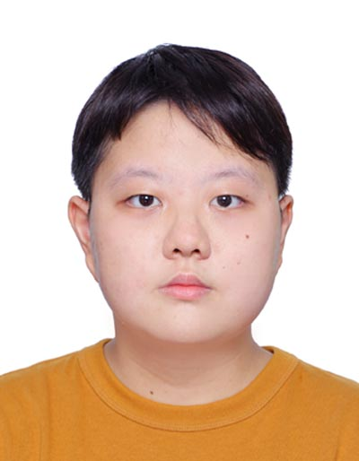
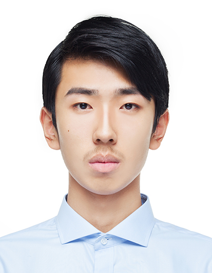

We are a team based in the [School of Computing, National University of Singapore](http://www.comp.nus.edu.sg).

## Project team

### Koh Zhe Hao

[[github](http://github.com/koh-zhe-hao)]
[[portfolio](team/koh-zhe-hao.md)]

* Role: Developer
* Responsibilities: General work and Update contacts implementation to contain new class Company

### Liu Chuyue

[[github](http://github.com/ramenmen)] [[portfolio](team/ramenmen.md)]

* Role: Developer
* Responsibilities: General work and Implementing new Meeting class

### Adithya Narayan Rangarajan Sreenivasan

[[github](http://github.com/AdithyaNarayan)]
[[portfolio](team/adithyanarayan.md)]

* Role: Developer
* Responsibilities: UI and Frontend
* In charge of `UI`
* JavaFX expert

### Tan Xuan Zhi

[[github](https://github.com/xxzz-tt)]
[[portfolio](team/xxzz-tt.md)]

* Role: Developer
* Responsibilities: Implement commands relating to model class Meeting

### Zhao Huan

[[github](http://github.com/zhaohuanqdcn)]
[[portfolio](team/zhaohuanqdcn.md)]

* Role: Developer
* Responsibilities: Update Model and Implement commands relating to Meeting
