* Table of Contents
{:toc}

--------------------------------------------------------------------------------------------------------------------

## **Setting up, getting started**
 
Refer to the guide [_Setting up and getting started_](SettingUp.md).

--------------------------------------------------------------------------------------------------------------------

## **Design**

### Architecture

The ***Architecture Diagram*** given above explains the high-level design of the App. Given below is a quick overview of each component.

:bulb: **Tip:** The `.puml` files used to create diagrams in this document can be found in the [diagrams](https://github.com/AY2021S1-CS2103T-W16-1/tp/tree/master/docs/diagrams/) folder. Refer to the [_PlantUML Tutorial_ at se-edu/guides](https://se-education.org/guides/tutorials/plantUml.html) to learn how to create and edit diagrams.

**`Main`** has two classes called [`Main`](https://github.com/AY2021S1-CS2103T-W16-1/tp/tree/master/src/main/java/seedu/address/Main.java) and [`MainApp`](https://github.com/AY2021S1-CS2103T-W16-1/tp/tree/master/src/main/java/seedu/address/MainApp.java). It is responsible for,
* At app launch: Initializes the components in the correct sequence, and connects them up with each other.
* At shut down: Shuts down the components and invokes cleanup methods where necessary.

[**`Commons`**](#common-classes) represents a collection of classes used by multiple other components.

The rest of the App consists of four components.

* [**`UI`**](#ui-component): The UI of the App.
* [**`Logic`**](#logic-component): The command executor.
* [**`Model`**](#model-component): Holds the data of the App in memory.
* [**`Storage`**](#storage-component): Reads data from, and writes data to, the hard disk.

Each of the four components,

* defines its *API* in an `interface` with the same name as the Component.
* exposes its functionality using a concrete `{Component Name}Manager` class (which implements the corresponding API `interface` mentioned in the previous point.

For example, the `Logic` component (see the class diagram given below) defines its API in the `Logic.java` interface and exposes its functionality using the `LogicManager.java` class which implements the `Logic` interface.

**How the architecture components interact with each other**

The *Sequence Diagram* below shows how the components interact with each other for the scenario where the user issues the command `deletemeeting 1`.

The sections below give more details of each component.

### UI component

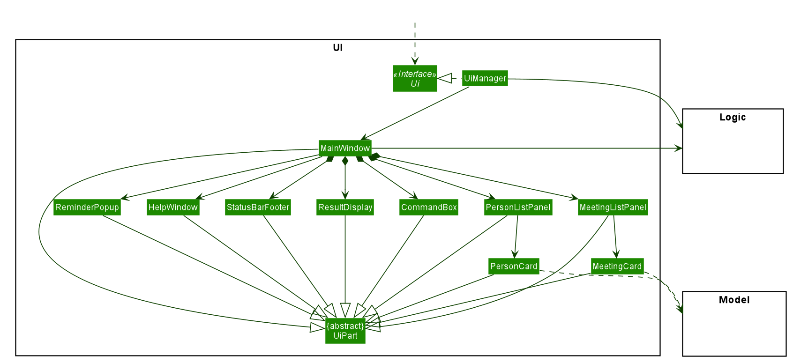

**API** :
[`Ui.java`](https://github.com/AY2021S1-CS2103T-W16-1/tp/tree/master/src/main/java/seedu/address/ui/Ui.java)

The UI consists of a `MainWindow` that is made up of parts e.g.`CommandBox`, `ResultDisplay`, `PersonListPanel`, `StatusBarFooter` etc. All these, including the `MainWindow`, inherit from the abstract `UiPart` class.

The `UI` component uses JavaFx UI framework. The layout of these UI parts are defined in matching `.fxml` files that are in the `src/main/resources/view` folder. For example, the layout of the [`MainWindow`](https://github.com/AY2021S1-CS2103T-W16-1/tp/tree/master/src/main/java/seedu/address/ui/MainWindow.java) is specified in [`MainWindow.fxml`](https://github.com/AY2021S1-CS2103T-W16-1/tp/tree/master/src/main/resources/view/MainWindow.fxml)

The `UI` component,

* Executes user commands using the `Logic` component.
* Listens for changes to `Model` data so that the UI can be updated with the modified data.
* Sometimes, Scheduler has a reference to UI to force an update to the UI based on current time. This is helpful for changing the location of the green bar and popup reminders.

### Logic component

**API** :
[`Logic.java`](https://github.com/AY2021S1-CS2103T-W16-1/tp/tree/master/src/main/java/seedu/address/logic/Logic.java)

1. `Logic` uses the `AddressBookParser` class to parse the user command.
1. This results in a `Command` object which is executed by the `LogicManager`.
1. The command execution can affect the `Model` (e.g. adding a person).
1. The result of the command execution is encapsulated as a `CommandResult` object which is passed back to the `Ui`.
1. In addition, the `CommandResult` object can also instruct the `Ui` to perform certain actions, such as displaying help to the user.

Given below is the Sequence Diagram for interactions within the `Logic` component for the `execute("deletemeeting 1")` API call.

 

:information_source: **Note:** The lifeline for `DeleteMeetingCommandParser` should end at the destroy marker (X) but due to a limitation of PlantUML, the lifeline reaches the end of diagram.

### Model component

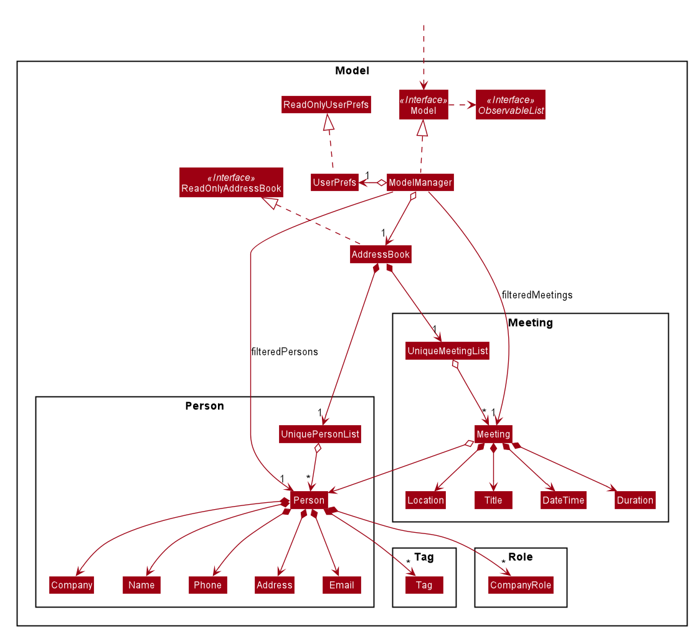

**API** : [`Model.java`](https://github.com/AY2021S1-CS2103T-W16-1/tp/tree/master/src/main/java/seedu/address/model/Model.java)

The `Model`,

* stores a `UserPref` object that represents the user’s preferences.
* stores the data of contacts and meetings.
* exposes unmodifiable `ObservableList<Person>` and `ObservableList<Meeting>` that can be 'observed' e.g. the UI can be bound to this list so that the UI automatically updates when the data in the list change.
* does not depend on any of the other three components.

:information_source: **Note:** An alternative (arguably, a more OOP) model is given below. It has a `Tag` list in the `AddressBook`, which `Person` references. This allows `AddressBook` to only require one `Tag` object per unique `Tag`, instead of each `Person` needing their own `Tag` object. 
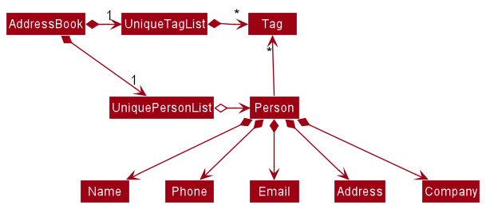

### Storage component

**API** : [`Storage.java`](https://github.com/AY2021S1-CS2103T-W16-1/tp/tree/master/src/main/java/seedu/address/storage/Storage.java)

The `Storage` component,
* can save `UserPref` objects in json format and read it back.
* can save the address book data in json format and read it back.

### Common classes

Classes used by multiple components are in the `seedu.addressbook.commons` package.

--------------------------------------------------------------------------------------------------------------------

## **Implementation**

This section describes some noteworthy details on how certain features are implemented.

### Add contact command

#### Implementation

The add meeting mechanism is facilitated by `AddContactCommandParser` and `AddContactCommand` which extend `Parser` and 
`Command` respectively. `AddContactCommandParser` is responsible for parsing the user's inputs to generate a new 
`AddMeetingCommand` with meeting, which then adds the meeting into the AddressBook.

Here are some of the most important operations implemented:

* `AddContactCommandParser#parse()`  —  Parse the user inputs to create a new person
* `AddContactCommand#execute()`  —  Add a new person in the model if it is valid and not a duplicate.

The `AddContactCommand#execute()` is exposed in the `Model` interface as `Model#addPerson()`and `Model#hasPerson(meeting)`.

The following sequence diagram shows how the add contact operation works:

:information_source: **Note:** The lifeline for `AddContactCommand` should end at the destroy marker (X) but due to a limitation of PlantUML, the lifeline reaches the end of diagram.

The following activity diagram summarizes the flow of events when a contact is being added:

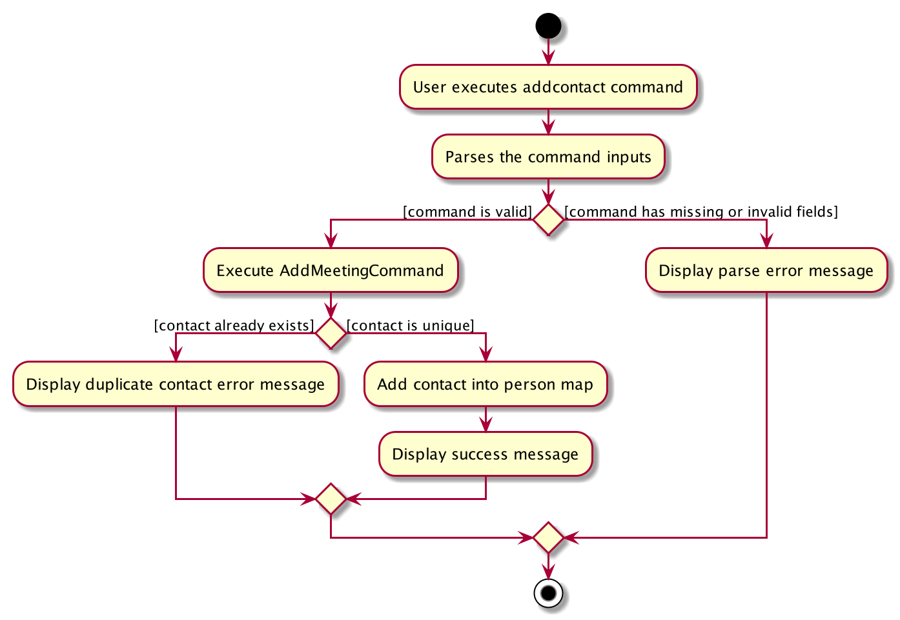

### Edit contact command

#### Implementation

The edit meeting mechanism is facilitated by `EditContactCommandParser` and `EditContactCommand` which extend `Parser` and 
`Command` respectively. `EditContactCommandParser` is responsible for parsing the user's inputs to generate a new 
`EditContactCommand` which then modifies a meeting at a specific index.

Here are some of the most important operations implemented:

* `EditContactCommandParser#parse()`  —  Parse the user inputs to create an edited meeting
* `EditContactCommand#execute()`  —  Add the edited meeting if it is not a duplicate and if its time does not clash with other meetings

The `EditContactCommand#execute()` is exposed in the `Model` interface as `Model#setPerson()` and `Model#hasPerson(meeting)`.

The following sequence diagram shows how the edit contact operation works:

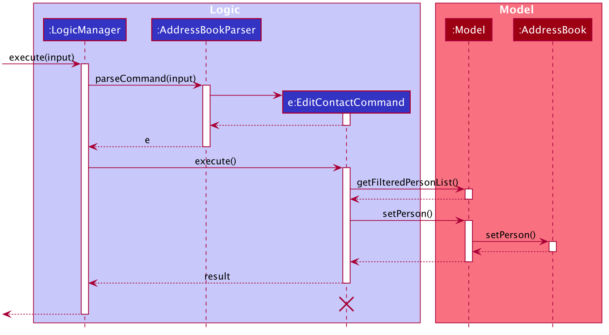

:information_source: **Note:** The lifeline for `EditContactCommand` should end at the destroy marker (X) but due to a limitation of PlantUML, the lifeline reaches the end of diagram.

The following activity diagram summarizes the flow of events when a contact is being added (Note that less important details are omitted for better clarity):

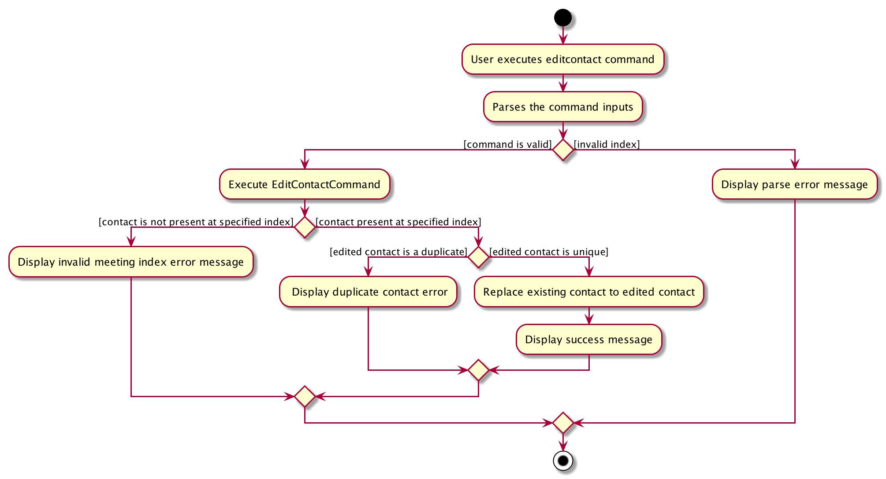

### Modelling Meetings 

#### Implementation

The Meetings class and meeting details classes are adapted from the code for Persons and person details.

The following is the Class Diagram for the meetings feature.

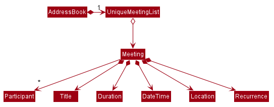

The Meetings class and meeting details classes are adapted from the code for Persons and person details. The Meeting class contains two methods that are not present in the Person class:

* `addParticipant(Person person)` — Adds person as a participant of the meeting.
* `delParticipant(Index index)` — Deletes the participant at index from the meeting's list of participants.

The following sequence diagram shows how the delete participant operation works:

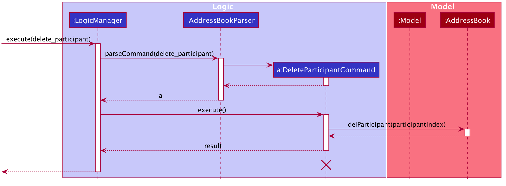

:information_source: **Note:** The lifeline for `DeleteParticipantCommand` should end at the destroy marker (X) but due to a limitation of PlantUML, the lifeline reaches the end of diagram.

The `addParticipant` command does the opposite with a similar sequence — it calls `Meeting#addParticipant(person)`.

The following activity diagram summarizes what happens when a user executes a delete participant command:

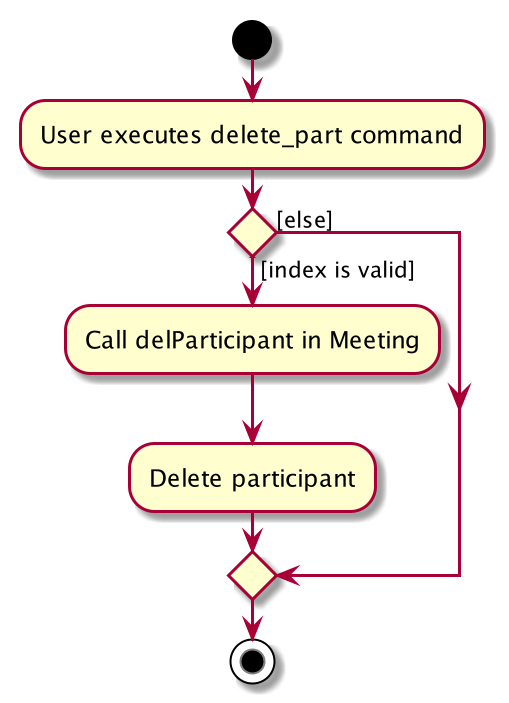

#### Design consideration:

##### Aspect: Why not make participants an attribute?

* Adding participants through index is not effectively when the contact base is large. On the other hand, using separate commands provides the possibility of combinatorial commands to improve efficiency. For instance, `FindContactCommand` can be applied between `AddMeetingCommand` and `AddParticipantCommand`, making it easier to locate the intended contact.

### Add meeting command

#### Implementation

The add meeting mechanism is facilitated by `AddMeetingCommandParser` and `AddMeetingCommand` which extend `Parser` and 
`Command` respectively. `AddMeetingCommandParser` is responsible for parsing the user's inputs to generate a new 
`AddMeetingCommand` with meeting, which then adds the meeting into the AddressBook.

Here are some of the most important operations implemented:

* `AddMeetingCommandParser#parse()`  —  Parse the user inputs to create a new meeting
* `AddMeetingCommand#execute()`  —  Add a new meeting in the model if it is valid and not a duplicate.

The `AddMeetingCommand#execute()` is exposed in the `Model` interface as `Model#addMeeting()`, `Model#hasConflict(meeting)` and `Model#sortMeeting()`.

Given below is a description on the flow of the add meeting mechanism behaves:

1. The user enters a new input for the addmeeting command
2. The `AddMeetingCommand#parse()` is called to parse the user inputs and create a new meeting object based on
the inputs if all required prefixes are present. Else, a `ParseException` will be thrown and the user will be prompted 
to fill in all required fields.
3. Upon successful parsing, `AddMeetingCommand#execute()` will be called. It will first check if the added meeting is unique
and if not, it will throw a `CommandException` and not add the meeting. 
4. Then,`AddMeetingCommand#execute()` will also check if the meeting has any clashing `date` with any other meeting and 
 throw a `CommandException` and not add the meeting if so. 
5. If a meeting is unique and has no clashing `date`, then `Model#addMeeting()` is called to add the meeting.
6. Lastly, `Model#sortMeeting()` is called to sort the `UniqueMeetingList` to make sure that all meetings are arranged according to time.

The following activity diagram summarizes the flow of events when a meeting is being added:

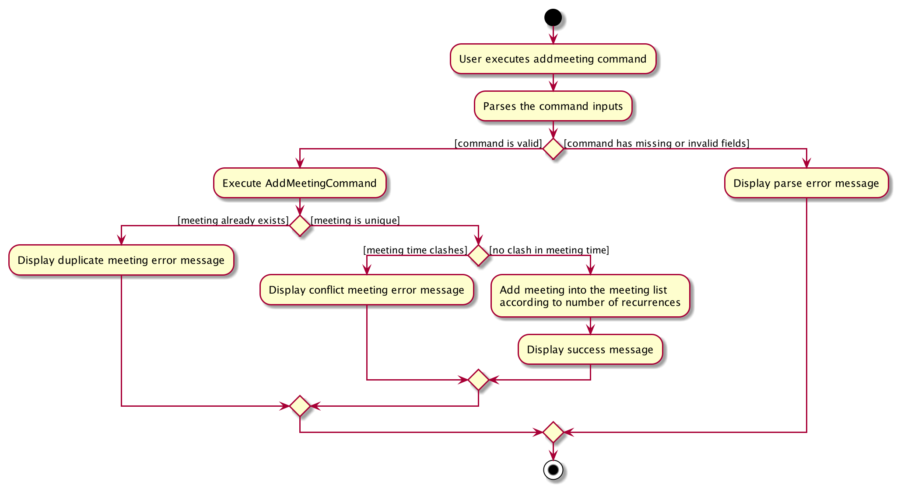

The following sequence diagram shows how the add meeting operation works:

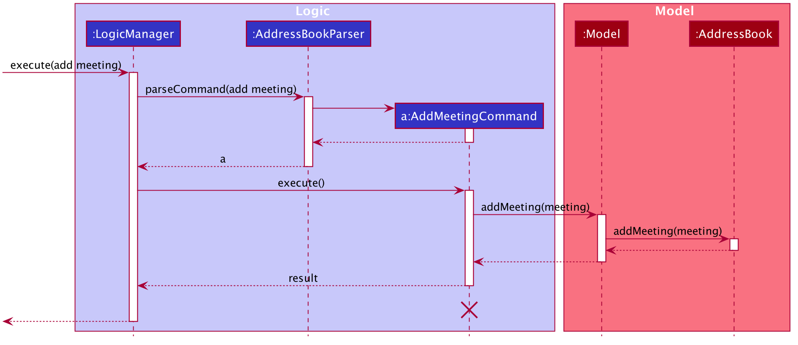

:information_source: **Note:** The lifeline for `AddMeetingCommand` should end at the destroy marker (X) but due to a limitation of PlantUML, the lifeline reaches the end of diagram.

### Edit meeting command

#### Implementation

The edit meeting mechanism is facilitated by `EditMeetingCommandParser` and `EditMeetingCommand` which extend `Parser` and 
`Command` respectively. `EditMeetingCommandParser` is responsible for parsing the user's inputs to generate a new 
`EditMeetingCommand` which then modifies a meeting at a specific index.

Here are some of the most important operations implemented:

* `EditMeetingCommandParser#parse()`  —  Parse the user inputs to create an edited meeting
* `EditMeetingCommand#execute()`  —  Add the edited meeting if it is not a duplicate and if its time does not clash with other meetings

The `EditMeetingCommand#execute()` is exposed in the `Model` interface as `Model#setMeeting()`, `Model#hasConflict(meeting)` and `Model#sortMeeting()`.

Given below is a description on the flow of the edit meeting mechanism behaves:

1. The user enters a new input for the editmeeting command
2. The `EditMeetingCommandParser#parse()` is called to parse the user inputs and create a `EditMeetingDescriptor` object based on
the inputs if a valid index (in this step, a positive integer suffices) is provided. Else, a `ParseException` will be thrown and the user will be prompted 
to fill in all required fields.
3. Upon successful parsing, `EditMeetingCommand#execute()` will be called to check if there is an existing meeting at the specified index.
If not, a `CommandException` will be thrown and no meeting will be edited.
4. If there is an existing meeting, `EditMeetingCommand#execute()` then creates a new edited meeting and checks if the edited meeting is
the same as the current meeting or a duplicate of other meetings. If so, it will throw a `CommandException`. 
4. Then,`EditMeetingCommand#execute()` also deletes the existing meeting and checks if the meeting has any clashing `date` with any other meeting
before adding the existing meeting back. If there is a clash, it throws a `CommandException` and not add the meeting. 
5. If a meeting is unique and has no clashes, then `Model#setMeeting()` is called to set the existing meeting to the edited meeting.
6. Lastly, `Model#sortMeeting()` is called to sort the `UniqueMeetingList` to make sure that all meetings are arranged according to time.

The following activity diagram summarizes the flow of events when a meeting is being added (Note that less important details are omitted for better clarity):

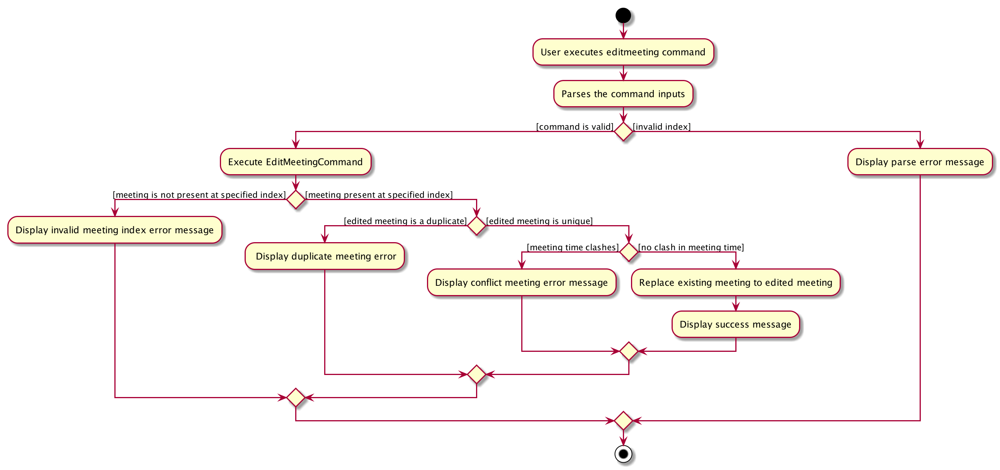

The following sequence diagram shows how the edit meeting operation works (Note that less important details are omitted for better clarity):

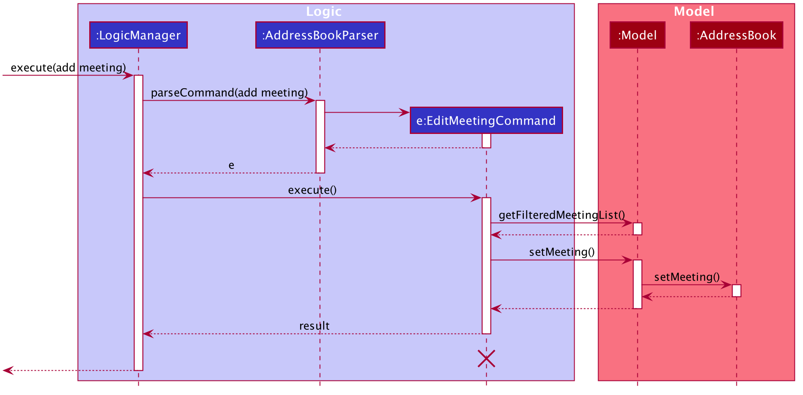

:information_source: **Note:** The lifeline for `EditMeetingCommand` should end at the destroy marker (X) but due to a limitation of PlantUML, the lifeline reaches the end of diagram.

#### Design consideration:

##### Aspect: Parameters taken for edit command

* Alternative 1 (current choice): Take in arguments for the same prefix more than once
  * Pros: Allow the user to enter different arguments for the same prefix multiple times so they do not have to backtrack
  and change the argument. Only the last argument corresponding to the prefix will be used.
  * Cons: User might unintentionally enter 2 arguments for the same prefix and find unexpected details in the edited meeting
* Alternative 2: 
  * Pros: Easy to uncover mistakes if the user has accidentally entered the same prefix more than once,
  and no ambiguity on which argument to use to create the edited meeting.
  * Cons: User has to re-enter the arguments again

### Delete meeting command

#### Implementation

The delete meeting mechanism is facilitated by `DeleteMeetingCommand`. It extends `Command`.

-   `DeleteMeetingCommand#execute()` —  Deletes the meeting (and possibly its recurrences) specified by an index.

The flow of a usual delete meeting execution cycle has been illustrated above as an example in [**logic component**](#logic-component):

#### Design consideration:

##### Aspect: which list to delete from?

*   `DeleteMeetingCommand` is implemented in a way so that it deletes the meeting specified by an index from the _last shown list_. This enables combinatorial commands which seem more intuitive. For instance, `deletemeeting 1` following a `FindMeetingCommand` deletes the first meeting from the search results, whereas the same command following a `ListMeetingCommand` deletes the first meeting from the whole meeting list.

### Find contact command

#### Implementation

The find contact mechanism is facilitated by `FindContactCommand`. It extends `Command`.

-   `FindContactCommand#execute()` —  Finds contacts where the name of contact matches given keywords.

Given below is the high-level class diagram based on `FindContactCommand` and its direct dependencies.

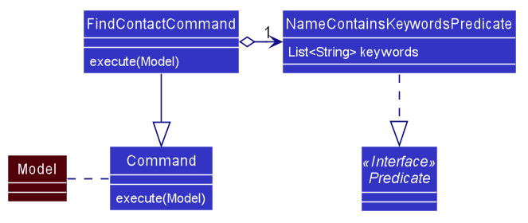

The given sequence diagram illustrates the flow of a usual find meeting execution cycle:

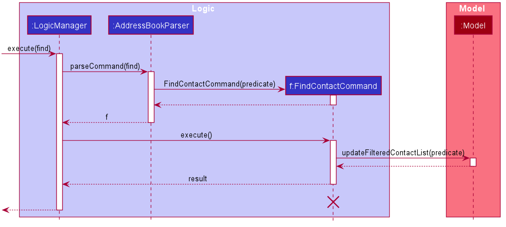

:information_source: **Note:** The lifeline for `FindContactCommand` should end at the destroy marker (X) but due to a limitation of PlantUML, the lifeline reaches the end of diagram.

### Find meeting command

#### Implementation

The find meeting mechanism is facilitated by `FindMeetingCommand`. It extends `Command`.

-   `FindMeetingCommand#execute()` —  Finds meeting where the data of meeting matches given keywords.

Given below is the high-level class diagram based on `FindMeetingCommand` and its direct dependencies.

The given sequence diagram illustrates the flow of a usual find meeting execution cycle:

:information_source: **Note:** The lifeline for `FindMeetingCommand` should end at the destroy marker (X) but due to a limitation of PlantUML, the lifeline reaches the end of diagram.

#### Design consideration:

##### Aspect: Keyword matching Title or Data?

*   Initially, mimicing the functionality of `FindContactCommand`, the find meeting only matched the keywords to the title. However, it made more sense to match other attributes like participant names, location and time since it would be easy to pinpoint which meetings take place where through a single find command.
*   Hence, the predicate matching logic was tweaked in order to accomodate other attributes to make the feature more robust.

##### DateTime matching using different formats

*   The DateTime is converted into various different formats before comparing with the keyword. This ensures that natural searching like "Nov" and "November" are correctly matched.

### List meeting command

#### Implementation

The list meeting mechanism is facilitated by `ListMeetingCommand`. It extends `Command`.

-   `ListMeetingCommand#execute()` —  Lists out all the meetings stored in the address book.

#### Design consideration:

##### Aspect: Why not use find?

*   Adding a syntax like `findmeeting` with empty keyword makes the list operation less intuitive. As `listmeeting` is a frequently used functionality, we decide to have a separate command.

### Clear meeting command

#### Implementation

The clear meeting mechanism is facilitated by `ClearMeetingCommand`. It extends `Command`.

-   `ClearMeetingCommand#execute()` —  Deletes all the meetings stored in the address book.

#### Design consideration:

##### Aspect: Why not use delete?

*   Adding a syntax like `deletemeeting all` command makes it hard to parse `DeleteMeetingCommand`, and `clearmeeting` itself is not very often used. 

### Undo command

#### Implementation

The undo mechanism is facilitated by `History` and `RecretaryState`. `History` stores the previous commands and `RecretaryState` stores a particular addressbook state and its command. `UndoCommand` which extends `Command`, acts as an entrypoint into accessing these classes.

-   `FindMeetingCommand#execute()` —  Finds meeting where the data of meeting matches given keywords.

Given below is the high-level class diagram based on `FindMeetingCommand` and its direct dependencies.

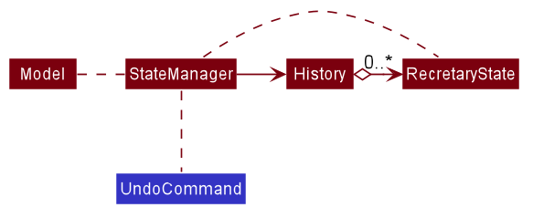

#### Design consideration:

##### Aspect: Memento Pattern vs Command Pattern

*   The undo feature had two different design implementations that we were considering. Due to a growing list of features we had in our app, we decided to choose memento instead of command as coding out an undo for each individual command is an arduous and time-consuming process.
*   Moreover, since the pre-existing architecture already has a `Model` that stores the state, it blends in well with the current architecture.

### System Timer

#### Implementation

A system timer is implemented to automatically update Ui (implemented) and send reminders (proposed) as time passes by if the app is running in the background (no user interaction). The timer is handled by `Scheduler` and `ScheduledTask`. The `Scheduler` keeps track of the next upcoming meeting, if any, and uses a `Timer` to start `ScheduledTask`. When the time comes, the `Timer` executes `ScheduledTask` where `Scheduler` and `Ui` are updated. The dependencies are shown in the diagram below.

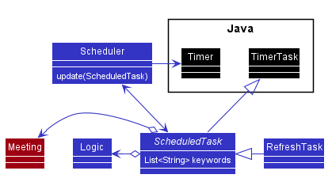

#### Design consideration:

##### Aspect: How to ensure the timer is valid?

* The `Scheduler` is updated at the start of application and after every user input. If the `ScheduledTask` is not replaced, which happens most of the time, the overhead is relatively low.

--------------------------------------------------------------------------------------------------------------------

## **Documentation, logging, testing, configuration, dev-ops**

* [Documentation guide](Documentation.md)
* [Testing guide](Testing.md)
* [Logging guide](Logging.md)
* [Configuration guide](Configuration.md)
* [DevOps guide](DevOps.md)

--------------------------------------------------------------------------------------------------------------------

## **Appendix: Requirements**

### Product scope

* **Target user profile**:
    * Potential Users (who prefer CLI/typing):
        * Coders
        * Authors/Bloggers/Journalists
        * **Personal Secretaries**
    * Potential Users (who need address book):
        * Business managers
        * **Personal Secretaries**
        * HR admins
        * Salespersons
    
    * Common in both: 
        * **Executive Personal Secretary**
    * Job Focus: 
        * Arrange conference calls and meetings
        * Manage clients
        * Send email correspondence
        * Make travel arrangements
    
* **Value proposition**: 
    * Minimise the workload
    * Easier to manage
    * Automate monotonous and repetitive tasks
    * Decrease human errors
    * Reduce typos and spelling mistakes
    * Optimise meeting timings and location
    * Reminders for important tasks/events

### User stories

Priorities: High (must have) - `* * *`, Medium (nice to have) - `* *`, Low (unlikely to have) - `*`

| Priority | As a …​                                    | I want to …​                     | So that I can…​                                                        |
| -------- | ------------------------------------------ | ------------------------------ | ---------------------------------------------------------------------- |
| `*`  |    meeting planner | create new meeting in my meeting list.| |
| `*`  |    meeting planner | update existing meetings | make sure the details are up to date.| 
| `*`  |    meeting planner | delete specified meetings if they are cancelled.| |
| `*`  |    meeting planner | view all upcoming meetings in chronic order.| |
| `*`  |    meeting planner | search for meetings with some keywords.| |
| `*`  |    frequent user | create new contact in my contact list.| |
| `*`  |    frequent user | update existing contact in my contact list.| |
| `*`  |    frequent user | search for a certain contact I am looking for.| |
| `*`  |    frequent user | view a list of all my contacts at any time.| |
| `*`  |    frequent meeting planner | attach a location and time of the meeting as additional information.| |
| `*`  |    frequent meeting planner | attach a location and time of the meeting as additional information.| |
| `*`  |    frequent meeting planner | create recurring meetings conveniently| avoid repetitive input. |
| `* *`  |    frequent meeting planner | receive reminders for upcoming meetings |  prepare for the meeting. | 
| `* *`  |    first time user | get a help page of the app  |  actually use the app to solve the tasks that I have.| 
| `* *`  |    long-time user | automatically archive expired meetings | I am not distracted by old meetings.| 
| `* *`  |    frequent meeting planner | export the meeting calendar  |  easily sync on other applications.| 
| `* *`  |    relatively new user | be prompted to change my invalid input  |  get it correctly from then on.|  
| `* * *`  |    first time user | find the list of all features that the app has | know what specific task can I complete by using this app.| 
| `* * *`  |    potential user exploring the app | see the app populated with sample data,  |  easily see how the app will look like when it is in use.|
| `* * *`  |    user ready to start using the app | clear all current data |  get rid of data I added when experimenting with the app.| 

### Use cases

(For all use cases below, the **System** is the `Recretary` and the **Actor** is the `user`, unless specified otherwise)

**Use case: UC01 - Add a contact**  

**MSS**  

1. User requests to add a new contact with the relevant details.
2. System indicates that the addition is successful.

Use case ends.

**Extensions**:

* 1a. System detects an error in the data.
  * 1a1. System requests for the correct data.
  * 1a2. User enters new data.
  
  Steps 1a1-1a2 are repeated until the data entered are correct.
  
  Use case resumes from step 2.

**Use case: UC02 - Add a meeting and its participants**  

**MSS**

1. User requests to add a new meeting with the location, title, datetime, duration and recurrences.
2. System indicates that meeting addition is successful and prompts user to add participants to the meeting.
3. User enters the participant's index on the displayed list (must be one of the contacts).
4. System indicates that the addition is successful.
5. User repeats step 3 until all participants are added.

Use case ends.

**Extensions**:

* 1a. System detects an error in the data.
  * 1a1. System requests for the correct data.
  * 1a2. User enters new data.
  
  Steps 1a1-1a2 are repeated until the data entered are correct.
  
  Use case resumes from step 2.
  
* 3a. Contact is not in System.
  * 3a1. System requests for the correct contact.
  * 3a2. User enters new contact name.
  
  Steps 3a1-3a2 are repeated until the data entered are correct.
  
  Use case resumes from step 4.

**Use case: UC03 - List all contacts or all meetings**  

**MSS**

1. User requests to list all contacts/ meetings
2. System shows the full list of contacts/ meetings

Use case ends.

**Extensions**:

* 2a. The requested list is empty.
  
  Use case ends.

**Use case: UC04 - Edit a contact**  

**MSS**

1. User requests to <ins> list all contacts (UC03)</ins>.
2. User requests to edit a contact with its index and new details.
3. System indicates that the update is successful.

Use case ends.

**Extensions**:

* 2a. The list is empty.

  Use case ends.

* 2b. User enters a negative integer as index.
  * 2b1. System indicates the error and requests for a non-negative index as index.
  * 2b2. User enters the correct index and new details.
  
  Steps 2b1-2b2 are repeated until the data entered are correct.  
  Use case resumes from step 3.
  
* 2c. User did not enter new details.
  * 2c1. System indicates the error and requests for the correct details.
  * 2c2. User enters the specific index and correct details.
  
  Steps 2c1-2c2 are repeated until the data entered are correct.  
  Use case resumes from step 3.

**Use case: UC05 - Edit a meeting**  

**MSS**

1. User requests to <ins> list all meetings (UC03)</ins>.
2. User requests to edit a meeting with its index and new details.
3. System indicates that the update is successful.

Use case ends.

**Extensions**:

* 2a. The list is empty.

  Use case ends.

* 2b. User enters a negative integer as index.
  * 2b1. System indicates the error and requests for a non-negative index as index.
  * 2b2. User enters the correct index and new details.
  
  Steps 2b1-2b2 are repeated until the data entered are correct.  
  Use case resumes from step 3.
  
* 2c. User did not enter new details.
  * 2c1. System indicates the error and requests for the correct details.
  * 2c2. User enters the specific index and correct details.
  
  Steps 2c1-2c2 are repeated until the data entered are correct.  
  Use case resumes from step 3.
 
* 2d. User requests to edit participant list.
  * 2d1. System shows current list of participants. 
  * 2d2. User enters the index of the participant he/she wants to remove.
  * 2d3. System shows the updated list of participants.
  
  Steps 2d1-2d2 are repeated until the user finishes editing.  
  Use case resumes from step 3.

**Use case: UC06 - Delete participant from the meeting**  

**MSS**

1. User requests to remove a particular participant from a specific meeting.
2. System shows a success message.

Use case ends.

**Extensions**:

* 1a. User enters a negative integer as index.
  * 1a1. System indicates the error and requests for a non-negative index as index.
  * 1a2. User enters the correct index.
  
  Steps 1a1-1a2 are repeated until the data entered are correct.  
  Use case resumes from step 2.
 
* 1b. The contact and/ or meeting does not exist at the specified index.
  * 1b1. System indicates the error and requests for a valid index.
  * 1b2. User enters the correct index.
  
  Steps 1b1-1b2 are repeated until the data entered are correct.  
  Use case resumes from step 2.

**Use case: UC07 - Find a contact or a meeting**  

**MSS**

1. User requests to search for a contact/meeting with keywords.
2. System shows the list of contacts/ meetings with matching keywords.

Use case ends.

**Extensions**:

* 1a. No contact/ meeting matched the keyword method.
  * 1a1. System shows a message indicating no matching records were found.
  Use case ends.

**Use case: UC08 - Delete a contact or a meeting**  

**MSS**

1. User requests to <ins> list all contacts/ meetings (UC03)</ins>.
2. User requests to remove a contact/ meeting from the list with its index.
3. System shows a success message 

Use case ends.

**Extensions**:

* 2a. The list is empty.

  Use case ends.

* 2b. User enters a negative integer as index.
  * 2a1. System indicates the error and requests for a non-negative index as index.
  * 2a2. User enters the correct index.
  
  Steps 2b1-2b2 are repeated until the data entered are correct.  
  Use case resumes from step 3.
 
* 2c. The contact deleted is a participant of some meeting.
  * 2c1. The contact is removed from the list of participants for all meetings.
  Use case ends.
  
* 2d. User requires to remove all recurrences of a meeting.
  * 2d1. System finds all recurrences of the meeting. 
  * 2d2. System removes all recurrences one after another. 
  Use case ends.
 
**Use case: UC09 - Clear all contacts or meetings**  

**MSS**

1.  User requests to clear contacts/ meetings.
2.  System indicates that the deletion is successful.

    Use case ends.
    
**Extensions**: 

* 1a. No contact/ meeting has been added.

  Use case ends.
  
  **Use case: UC09 - Export all meetings**  

  **MSS**

  1.  User requests to export meetings.
  2.  System indicates that the export is successful.
  3. User finds the exported file in the `data` folder.

      Use case ends.
      
  **Extensions**: 

  * 1a. No contact/ meeting has been added.

    Use case ends.

**Use case: UC09 - Undo commands**  

**MSS**

1.  User executes a command that he wishes to undo.
2.  User executes an undo command with a given index.
3.  System revokes the commands and displays the commands that were undone.

    Use case ends.
    
**Extensions**: 

* 2a. Undo INDEX is more than the history of commands.

  Use case ends.

* 3a. Export command cannot be undone.
  * 3a1. User notified that exported ics isn't deleted.
  
  Use case ends. 

### Non-Functional Requirements

1.  Should work on any mainstream OS as long as it has Java `11` or above installed.
2.  Should be able to hold up to 1000 persons without a noticeable sluggishness in performance for typical usage.
3.  A user with above average typing speed for regular English text (i.e. not code, not system admin commands) should be able to accomplish most of the tasks faster using commands than using the mouse.
4.  Should be portable. The executable must be one-click run.
5.  The data must be saved onto the hard disk and must be transferrable. In case of unexpected shutdown, the data must be preserved. The data should be human readable.
6.  Each new update should be backwords-compatable with the data from the previous versions so that it will be easy for users to port over.
7.  The app must speeden the workflow of the secretary and not be of hinderance.  

### Glossary

* **API**: Application Programming Interface
* **UML**: Unified Modeling Language
* **CLI**: Command Line Interface
* **GUI**: Graphic User Interface
* **MSS**: Main Success Scenario (aka Main Flow of Events)
* **Java FX**: Standard GUI library for Java SE
* **Mainstream OS**: Windows, Linux, Unix, OS-X

--------------------------------------------------------------------------------------------------------------------

## **Appendix: Effort**

Overall, we believe that compared to the difficulty level of AB3 at 10, the effort required for our project would be 15.

### Difficulty Level

Compared to AB3, our project is much more challenging. We added a new entity, Meeting, with its own function and command classes, by adapting code for AB3. In addition to that, we overhauled the entire UI, and added many new functionalities. For instance, command history, undo function, and meeting reminders. We also had to add elements to the pre-existing AB3 Person code to complement our new features. The new additions were much harder to implement as we had no basis to follow and had to hammer out the details and choose the most efficient implementation ourselves.

### Challenges Faced
Since the project began, we have overcome many challenges in implementation.
- We realised our initial implementation of meeting participants would cause participants to be unlinked from the Contact class after restarting the app. After a long discussion, we decided to add unique identifiers to each contact and use that to refer to meeting participants, so that the information would be updated promptly even after restarting.
- We implemented a completely new UI for our app that shows both contacts and meetings at the same time. However, the new implementation required the app to be fullscreen at all times. We realised the difficulty of implementing this as different implementations would not work on both Windows and Mac. Hence we realised the importance of cross-platform testing at every stage of implementation and were able to solve the problem eventually. 
- We realised that the meetings class required a different way to add participants as the participants needed to be searched for as contacts. Hence we decided to use adding and deleting participants commands that are independent of the add meeting command.
- We implemented our meeting schedule on a separate thread. However, the arguments accepted by that thread could not be modified after passing them, and it was thus unsuitable for using in the UI to display the meeting schedule. Hence, we decided to use the JavaFX default UI thread to solve the problem.

### Effort Required
We estimate that the effort required to code our new features is much higher than that of AB3. We were required to come up with new ways to implement associations between the many new classes that we added. We also had to overcome many obstacles during implementation that would hinder future functions, and had to come up with creative solutions for those problems. Hence our effort was above and beyond that needed for AB3.

### Achievements
- Implemented a new UI that is completely upgraded from the AB3 UI. 
- Implemeneted new features to sort meetings by date and time and display the meeting schedule.
- implemented a new type of instruction with two indexes (addpart and deletepart).
- Implemented new features that improve user experience (command history, undo).
- Implement a function to increase compatibility between our app and other apps (exportmeeting).
--------------------------------------------------------------------------------------------------------------------

## **Appendix: Instructions for manual testing**

Given below are instructions to test the app manually.

:information_source: **Note:** These instructions only provide a starting point for testers to work on;
testers are expected to do more *exploratory* testing.

### Launch and shutdown

1. Initial launch

   1. Download the jar file and copy into an empty folder

   1. Double-click the jar file Expected: Shows the GUI with a set of sample data. The window size should be maximized to full screen. Users are expected to use the app at this window size for it to have the correct performance.

2. Shutdown
    1. Simply enter the `exit` command to shutdown the app

### Add a contact
1. Add a new contact to the addressbook

    1. Prerequisites: The new contact does not already exist in the addressbook. In case that a duplicate contact was added, Recretary will prompt the user about this exception.
    
    1. Test case: `addcontact n/John Doe p/98765432 e/johnd@example.com a/John street, block 123, #01-01 c/ABC Holdings Pte. Ltd`  
       Expected: The contact is successfully added to the addressbook.
       
    1. Test case: `addcontact n/John Doe p/ e/johnd@example.com a/John street, block 123, #01-01 c/ABC Holdings Pte. Ltd`  
       Expected: The contact is not added because `p/`. User should see the error message in the feedback box.
       
    1. Test case: `addcontact p/98765432 e/johnd@example.com a/John street, block 123, #01-01 c/ABC Holdings Pte. Ltd`  
       Expected: The contact is not added to the addressbook because of the missing name field, eg:`n/John Doe`.
       
    1. Test case: `addcontact abcd n/John Doe p/98765432 e/johnd@example.com a/John street, block 123, #01-01 c/ABC Holdings Pte. Ltd`  
       Expected: The contact is not added to the addressbook because of the random String `abcd`.
         
### Edit a contact
1. Edit an existing contact in the addressbook

    1. Prerequisites: The new contact does not already exist in the addressbook. In case that a duplicate contact was added, Recretary will prompt the user about this exception. 
    
    1. Test case: `editcontact 1 t/`
    Expected: The tag for the first contact after the `list` command has been cleared.
    
    1. Test case: `editcontact 1 `
    Expected: An exception was shown the prompt user to enter at least one field to be edited.
    
### Deleting a contact

1. Deleting a person while all persons are being shown

   1. Prerequisites: List all persons using the `list` command. Multiple persons in the list.

   1. Test case: `deletecontact 1` 
      Expected: First contact is deleted from the list. Details of the deleted contact shown in the status message. Timestamp in the status bar is updated.

   1. Test case: `deletecontact 0` 
      Expected: No person is deleted. Error details shown in the status message. Status bar remains the same.

   1. Other incorrect delete commands to try: `delete`, `delete x`, `...` (where x is larger than the list size) 
      Expected: Similar to previous.

### Add a meeting
1. Add a new meeting to the addressbook 

    1. Prerequisites: The meeting does not already exist in the addressbook or conflict with any other meetings in the addressbook. 
    
    1. Test cases: `addmeeting title/roundtable discussion d/31/12/20 1200 dur/00 30 l/NUS SoC` `addmeeting title/roundtable discussion two d/31/12/20 1201 dur/00 30 l/NUS SoC` 
    Expected: An error being shown telling the user that the second meeting conflicts with the first meeting
    
    1. Test cases: `addmeeting d/31/12/20 1200 dur/00 30 l/NUS SoC` 
    Expected: An error being shown because the command is missing the compulsory title field, eg: `title/roundtable discussion`
    
    1. Test cases: `addmeeting title/roundtable discussion d/31/12/20 1200 dur/00 30 l/NUS SoC rec/yearly/30` 
    Expected: An error being shown indicating wrong recurrence format because there is no option for `yearly` and `/30` is greather than the maximum value allowed which is 20
    
    1. Other incorrect commands that have extra random String or invalid value for a specific prefix 
    Expected: An error being shown indicating wrong command format and suggest a correct usage.
    
### Adding a participant into a meeting
1. Add participant to an existing meeting in the addressbook
    
    1. Prerequisite: The meeting should already exist in the addressbook (the index should be valid).
    
    1. Test cases: `findcontact alice` followed by `addpart ci/1 mi/2`
    Expected: Succesfully adds the first contact of the `findcontact` command's result into the 2nd meeting.
    
    1. Test cases: `addpart ci/-1 mi/-1`
    Expected: An error being shown because the index for existing contact and meeting is invalid
    
    1. Test cases: `addpart ci/-1`
    Expected: An error being shown because the compulsory meeting index filed is missing, eg: `mi/1`

### Editing a meeting
1. Edits an existing meeting in the meeting schedule

    1. Prerequisite: The meeting should already exist in the addressbook (the index should be valid).
    
    1. Test cases: `editmeeting -1 d/10/11/20 1400 l/clementi`
    Expected: An error being shown because the index is invalid or empty
    
    1. Test cases: "editmeeting 1"
    Expected: An error being shown because at least one filed needs to be specify
    
    1. Other test cases that doesn't follow the prefix convention
    Expected: An error being shown because it does not follow the correct format
    
    1. Other test cases that make an existing meeting identical to another meeting in the list
    Expected: An error being shown because the edited meeting should be unique in the list
    
    1. Other test cases that make an existing meeting conflict with another meeting in the list
    Expected: An error indicate this conflict issue being shown
   
### Locating a meeting
1. Find meetings whose data (matches title, date in all natural formats, location) contain any of the given keywords.

    1. Test cases: `findmeeting`
    Expected: An error indicates invalid command format being shown because the arguments cannot be empty
    
    1. Test cases: `findmeeting abc def`
    Expected: A list of meetings such as `abc meeting`, `def meeting` or 0 meeting being displayed.
    
### Deleting a meeting
1. Deletes the specified item (and its recurrences) from the address book.

    1. Prerequisites: The index should be a valid index (<= the largest meeting index). 
    
    1. Test cases: `deletemeeting 1`
    Expected: The 1st meeting in the displayed meeting list being deleted or shows an error if the displayed meeting list is empty.
    
    1. Test cases: `deletemeeting 2 rec/true`
    Expected: The 2nd meeting being displayed in meeting list and all its recurrences being deleted; or show an error if there is only one meeting being displayed in list.
    
    1. Test cases: `deletemeeting`
    Expected: An invalid command format error being shown because meeting index can't be empty.

### Remind a meeting
1. Search and display all meetings that will occur within the hours specify by the user.

    1. Test cases: `remindmeeting 1440`
    Expected: All meeting within 1440 hours being displayed, empty display if 0 meeting is found
    
    1. Test cases: `remindmeeting 0`
    Expected: An error being shown because the input value is not in the valid range
    
    1. Other test cases that contain random text
    Expected: An error indicates Unknown command or Invalid command format being shown.
    
### Update user preference
1.  Edit the value of interval between meetings.
    
    1. Test cases: `edituserpref 10`
    Expected: The value for `intervalBetweenMeetings` stored inside `preferences.json` is changed to 10.
        
    1. Test cases: `edituserpref 0`
    Expected: An error being shown because the input value is not in the valid range.
    
    1. Other test cases that contain random text
    Expected: An error indicates Unknown command or Invalid command format being shown.

### Saving data

1. Dealing with missing/corrupted data files

   1. Run Recretary without a `addressbook.json` inside the data folder.  
   Expected: Recreatary will perform as per normal with sample data loaded.
   
   2. Run Recretary with a corrupted `addressbook.json` (data are stored in wrong format, random text somewhere,etc).  
   Expected: Recreatry will perform as per normal with an empty addressbook.
   
   3. Run Recretary without a `preferences.json` inside the root directory.  
   Expected: Recretary will perform as per normal with the default data loaded.
   
   4. Run Recretary with a corrupted `preferences.json` inside the root directory (data are stored in wrong format, random text somewhere,etc).  
   Expected: Recretary will perform as per normal with the default data loaded.

