* Table of Contents
{:toc}

## 1 Introduction

Hello, fellow secretaries!

Welcome to Recretary, a desktop application to help you manage contacts and meetings so that you can be freed from 
these tedious tasks. 

If you are still keeping track of your contacts and meetings manually and find that tiresome, then Recretary is the 
solution for you! Recretary is specially customised for secretaries to make the contact and meeting management process 
as easy and as error-free as possible. What's more, Recretary is primarily optimized for use via a Command Line Interface
(CLI), which means that you can use most features with just a single line of command. If you can type fast, will be able 
to manage your contacts and meetings much more efficiently on our sleek Graphical User Interface (GUI).

If you are new to CLI or Recretary, fret not! Explore our User Guide now to find out more on our amazing features and how
they work!

### 1.1 Overview of the User Interface

As you can see in Fig. 1, the user interface of the app is sleek and beautiful, but still gives you all the information that is required. The contacts are arranged in the left and the meetings are arranged in the right. All the meetings are always sorted according to time (earliest first). The meeting timeline draws your attention into the current time and the next meeting that is scheduled to take place.

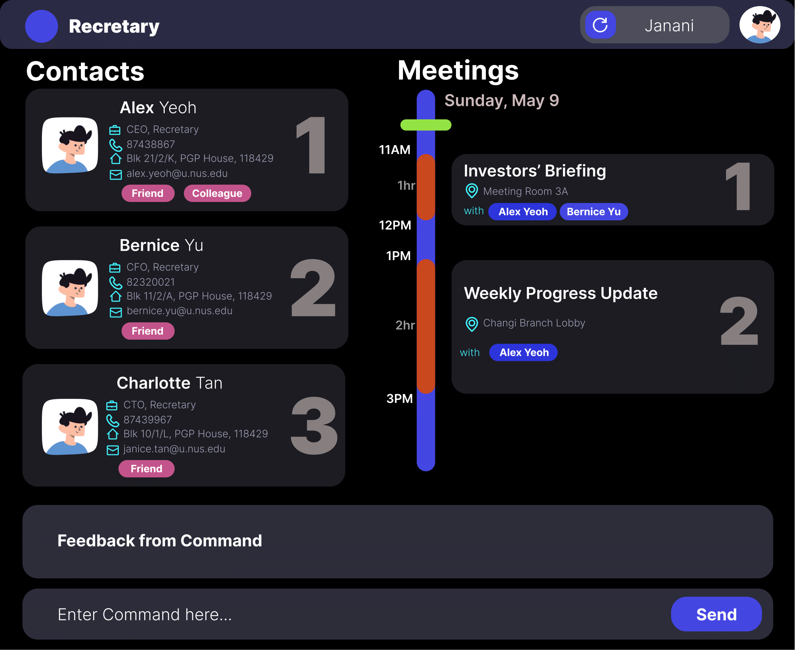
<p align="center">Fig. 1: User Interface</p>

To ensure maximum efficiency, we have made the app default to a full screen. The app has been made keeping full screen usage in mind.

## 2 Using the user guide

This section will give you, the user, all the details required to interpret and understand the user guide and use it to your advantage. This guide encompasses all the features that the app provides with in-depth explanation on how to use them in the app with examples and illustrations.

### 2.1 Format

| Symbol/Formatting | Explanation |
|-------------------|-------------|
| Monospaced Codeblocks (eg: `example`)                 | User input, command box output           |
| :bulb:                 | A tip to increase your efficiency           |
| :information_source:                 | Notes. An important must read before you execute a command           |
| :framed_picture: | Visual Walkthrough. Images to guide you through an example use of the command step by step |


**Notes about the command format:**<br>

-   Words in `UPPER_CASE` are the parameters to be supplied by the user.<br>
    e.g. in `addcontact n/NAME`, `NAME` is a parameter which can be used as `addcontact n/John Doe`.

-   Items in square brackets are optional.<br>
    e.g `n/NAME [t/TAG]` can be used as `n/John Doe t/friend` or as `n/John Doe`.

-   Items with `…`​ after them can be used multiple times including zero times.<br>
    e.g. `[t/TAG]…​` can be used as ` ` (i.e. 0 times), `t/friend`, `t/friend t/family` etc.
    
-   Parameters with prefixes can be in any order.<br>
    e.g. if the command specifies `INDEX n/NAME p/PHONE_NUMBER`, `INDEX p/PHONE_NUMBER n/NAME` is also acceptable whereas `p/PHONE_NUMBER INDEX n/NAME` is not correct since `INDEX` has no prefix.   
   
-   Although it is not recommended to supply duplicate parameters, they will still be accepted. However, only the last parameter of the same type will be considered.<br>
    e.g. if the command entered by user is `editcontact 1 n/John n/Bob`, only `n/Bob` will be considered as only the last of the two `n/` parameters is considered. 

### 2.2 Navigation

This user guide was made taking in mind the ease of usability and navigation. You can easily click on the headings and sub-headings in the table of contents (and also other parts where a heading is mentioned) and it will take you right into the required part of the guide. 

Here is a quick summary of relevant links you can take a look at if you wish to brush through the user guide.

- Get up and running as soon as possible: [Quick Start](#quick-start)
- For a summary of the features on this user guide: [Command Summary](#command-summary)

## 3 Quick start

This section contains a step-by-step guide on how to install Recretary on your computer as well as some basic commands 
for you to get familiarise with Recretary. 

### 3.1 Installation

1. Ensure you have Java `11` or above installed in your Computer.

1. Download the latest `recretary.jar` from [here](https://github.com/AY2021S1-CS2103T-W16-1/tp/releases).

1. Copy the file to the folder you want to use as the _home folder_ for Recretary.

1. Double-click the file to start the app. The GUI similar to the below should appear in a few seconds. Note how the app contains some sample data. You can get familiar with our app by following the simple instructions below and observe the changes in your GUI. You can also just type `clearcontact` and `clearmeeting` separately to clear all data.
   

1. For you to get familiar with the app and to practice, type the command in the command box and press Enter to execute it. e.g. typing **`help`** and pressing Enter will open the help window.
   Some example commands you can try:

    - **`listcontact`** : Lists all contacts.

    - **`addcontact`** `add_contact n/John Doe p/98765432 e/johnd@example.com a/John street, block 123, #01-01 c/ABC Holdings Pte. Ltd` : Adds a contact named `John Doe` to the Address Book.

    - **`deletemeeting`**`1` : Deletes the 1st meeting shown in the current list.

    - **`clearmeeting`** : Deletes all meetings.
    
    - **`clearcontact`** : Deletes all contacts. 

    - **`exit`** : Exits the app.

1. Refer to the [Features](#features) below for details of each command.

## 4 Features

This section contains detailed information of each of Recretary's commands, with relevant examples and images to guide you. 

### 4.1 Contact Management

Contact entries in Recretary contain multiple pieces of information: name, phone number, email, address and company. There are also optional entries company role and tags that may help you organize your contacts better. You can find contact information on the left-hand-side of the window.

#### 4.1.1 Adding a person: `addcontact`

Adds a person to the address book.

Format: `addcontact n/NAME p/PHONE_NUMBER e/EMAIL a/ADDRESS c/COMPANY [r/COMPANY_ROLE]…​ [t/TAG]…​`

<div markdown="span" class="alert alert-primary">:bulb:

**Tip:**
A person can have any number of tags and company roles (including 0)

</div>

Examples:

-   `addcontact n/John Doe p/98765432 e/johnd@example.com a/John street, block 123, #01-01 c/ABC Holdings Pte. Ltd`
-   `addcontact n/Betsy Crowe t/friend e/betsycrowe@example.com a/Newgate Mansion p/1234567 r/CEO c/DEF Company`

Example Usage
```
addcontact n/Amanda Jo p/81234567 e/amanda@example.com a/PGP House c/Facebook t/friend
```
Expected result: 
```
New person added: Amanda Jo Phone: 81234567 Email: amanda@example.com Company: Facebook Address: PGP House Tags: [friend] Company roles: 
```
#### 4.1.2 Listing all persons: `listcontact`

Shows a list of all contacts in the address book. Any trailing words following the `listcontact` command will be ignored by the application.

Format: `listcontact`

Example Usage
```
listcontact
```

Expected result: 
```
Listed all persons
```

All existing contacts are listed.

#### 4.1.3 Editing a person: `editcontact`

Edits an existing person in the address book.

Format: `editcontact INDEX [n/NAME] [p/PHONE] [e/EMAIL] [a/ADDRESS] [c/COMPANY] [t/TAG]… [r/COMPANY_ROLE]…`

-   Edits the person at the specified `INDEX`. The index refers to the index number
    shown in the displayed person list. The index **must be a positive integer** 1, 2, 3, …​
-   At least one of the optional fields must be provided.
-   Existing values will be updated to the input values.
-   When editing tags, the existing tags of the person will be removed i.e adding of tags is not cumulative.
-   You can remove all the person’s tags by typing `t/` without
    specifying any tags after it.

Examples:

-   `editcontact 1 p/91234567 e/johndoe@example.com` Edits the phone number and email address of the 1st person to be
    `91234567` and `johndoe@example.com` respectively.
-   `editcontact 2 n/Betsy Crower t/` Edits the name of the 2nd person to be `Betsy Crower` and clears all existing tags.

Example Usage
```
editcontact 1 n/Kelly Low e/kelly@example.com
```
Expected result: 
```
Edited Person: Kelly Low Phone: 98764432 Email: kelly@example.com Company: ABC Holdings Pte. Ltd Address: John street, block 123, #01-01 Tags:  Company roles: 
```
#### 4.1.4 Locating persons: `findcontact`

Find contacts whose names contain any of the given keywords.

Format: `findcontact KEYWORD [MORE_KEYWORDS]`

-   The search is case-insensitive. e.g `hans` will match `Hans`
-   The order of the keywords does not matter. e.g. `Hans Bo` will match `Bo Hans`
-   Only the name is searched.
-   Only full words will be matched e.g. `Han` will not match `Hans`
-   Persons matching at least one keyword will be returned (i.e. `OR` search).
    e.g. `Hans Bo` will return `Hans Gruber`, `Bo Yang`

Examples:

-   `findcontact John` returns `john chan` and `John Doe`
-   `findcontact bernice david` returns:
    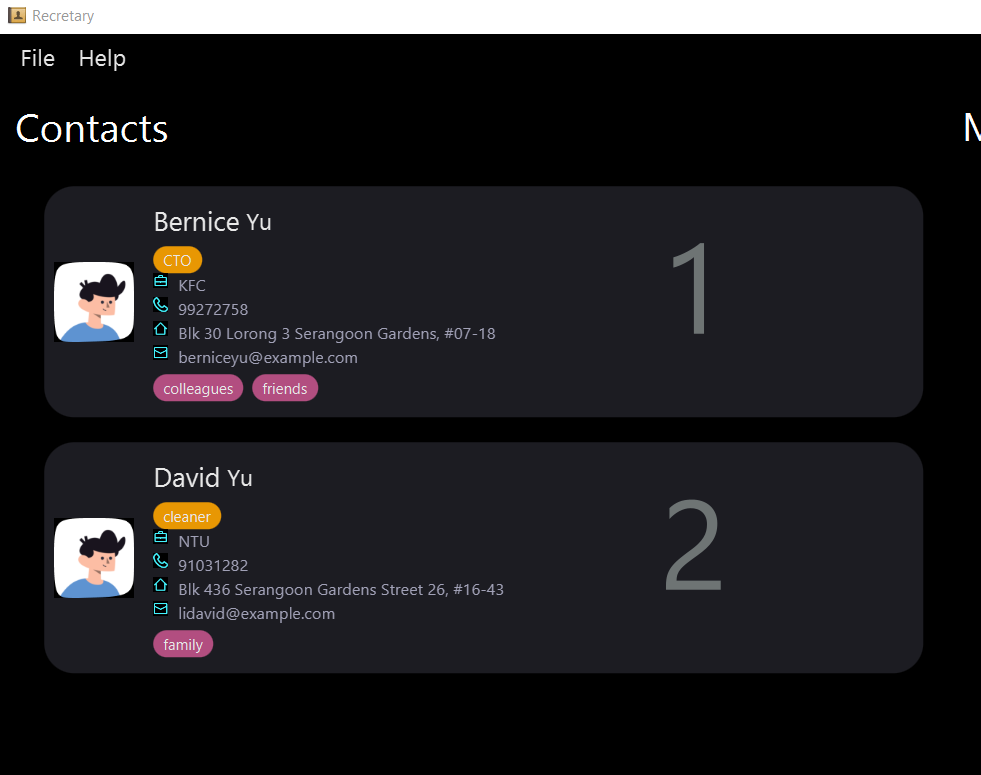

<div markdown="span" class="alert alert-primary">:framed_picture:

**Visual Walkthrough Guide:**

State of the app *BEFORE* the `findcontact John` command.

   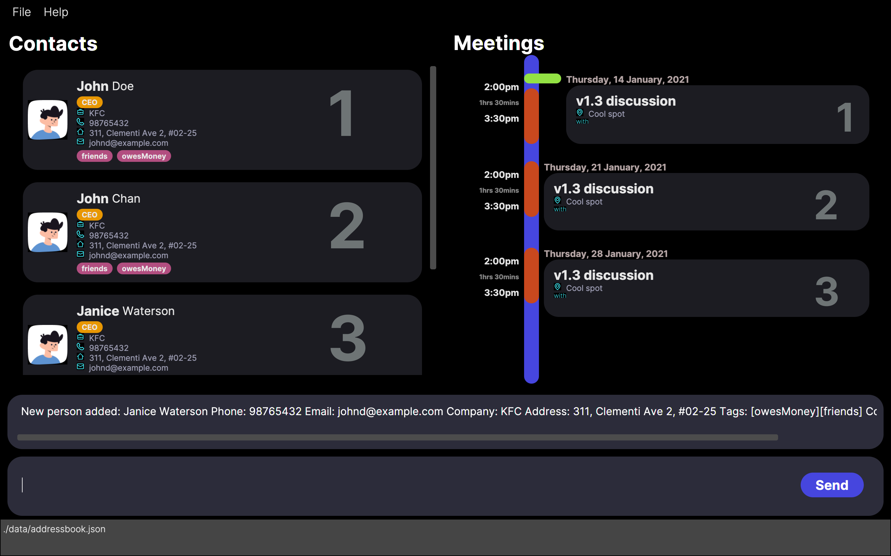

State of the app *AFTER* the `findcontact John` command.

   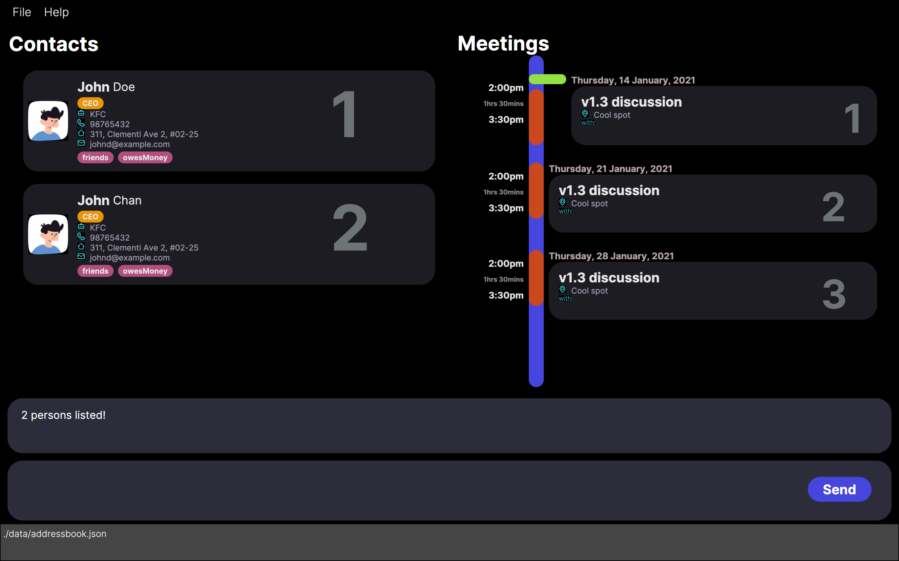

</div>


#### 4.1.5 Deleting a person: `deletecontact`

Deletes the specified person from the address book.

Format: `deletecontact INDEX`

* Deletes the person at the specified `INDEX`.
* The index refers to the index number shown in the displayed list.
* The index **must be a positive integer** 1, 2, 3, …​

Examples:
* `deletecontact 2` deletes the 2nd contact in the address book.

* `findcontact Betsy` followed by `deletecontact 1` deletes the 1st contact in the resulting displayed list of the `find` command.

Example Usage
```
deletecontact 1
```

Expected result: 
```
Deleted Person: Kelly Low Phone: 98765432 Email: kelly@example.com Company: ABC Holdings Pte. Ltd Address: John street, block 123, #01-01 Tags:  Company roles: 
```
Deletes the first contact in the currently displayed contact list. 

#### 4.1.6 Clearing all contacts: `clearcontact`

Clears all contacts from the address book. Anything following the `clearcontact` keyword will be ignored by the application.

Format: `clearcontact`

Example Usage
```
clear contact
```

Expected result: 
```
Contacts have been cleared!
```
Remove all existing contacts from Recretary. You can now see an empty contact list.
// add a warning here

### 4.2 Meeting Management

Meeting entries in Recretary have multiple attributes: date time, duration, title and location. You may declare the recurrence of a meeting to avoid repetitive input, 
and you may also add contacts as participants of a meeting. All meeting information will be displayed on the right-hand-side of the window, 
ordered by their starting time, with a green bar indicating the next upcoming meeting. When the next upcoming meeting starts, the green bar will move to the next meeting automatically, if any. 

#### 4.2.1 Adding a meeting: `addmeeting`

Adds a meeting into the meeting schedule. The existing list of meetings will be automatically sorted after the addition according to date and time. 
**Note:**
Conflict checking will not report an error if user supply new interval value that causes old meetings to conflict with each other. This is because interval is there to simulate travelling time,etc and should be different (and they passed the previous conflict check when added).

Format: `addmeeting title/TITLE d/DATETIME dur/DURATION l/LOCATION [rec/RECURRENCE]`

<div markdown="block" class="alert alert-info">

**:information_source: Notes about the command format:**<br>

-   The format for `DATETIME` is `d/M/yy HHmm`. <br>
    e.g. `d/1/11/20 1430`.
    e.g. `d/1/1/20 1430`.
    e.g. `d/12/11/20 1430`.

-   The format for `DURATION` is `H mm`, where `H` and `mm` must be non-negative numbers and cannot both be zero. <br>
    e.g. `dur/1 30`.
    
-   The number of minutes in `DURATION` cannot exceed `59`.

-   The field `RECURRENCE` consists of two parts separated by `/`. The first part can be one of `daily`, `weekly` or `monthly` indicating the frequency of recurrences, and the second part is a positive integer no more than 20 to indicate the number of recurrences. <br>
    e.g. `daily/1`,
    e.g. `weekly/20`,
    e.g. `monthly/5`


</div>

Example:
- `addmeeting title/roundtable discussion d/31/12/20 1200 dur/00 30 l/NUS SoC`
- `addmeeting title/abc company meeting d/31/12/20 1400 dur/00 50 l/John street, block 123, #01-01 rec/weekly/5`

Example usage:
```
addmeeting title/v1.5 discussion d/12/12/20 1200 dur/02 00 l/Home
```

Expected result:
```
New meeting added: v1.5 discussion Date and Time: 12 Dec 2020 12.00pm Duration: 2hrs Location: Home Recurrence: Participants: none 
Add participants with the addpart command now!
```

<div markdown="span" class="alert alert-primary">:bulb:

**Note:**
After adding a meeting, add new participants to it with the `addpart` command described below.
Only people in your contacts can be added as participants.

</div>

#### 4.2.2 Adding a participant into a meeting: `addpart`

Adds a participant with the specified `CONTACT_INDEX` in the currently viewable contact list into the meeting with the specified `MEETING_INDEX`.

Format: `addpart ci/CONTACT_INDEX mi/MEETING_INDEX`

<div markdown="span" class="alert alert-primary">:bulb:

**Tip:**
Run a `findcontact` command before running an `addpart` to narrow the contact list so that you can easily add a contact instead of scrolling through the whole list!

Likewise, run a `findmeeting` command before running an `addpart` to narrow the meeting list so that you can easily add a meeting instead of scrolling through the whole list!

</div>

Examples:

-   `addpart ci/1 mi/3` adds the first contact in the whole list to the 3rd meeting.
-   `findcontact alice` followed by `addpart ci/1 mi/2` adds the first contact of the `findcontact` command's result into the 2nd meeting.

Example Usage: 
```
addpart ci/1 mi/1
```

Expected result:

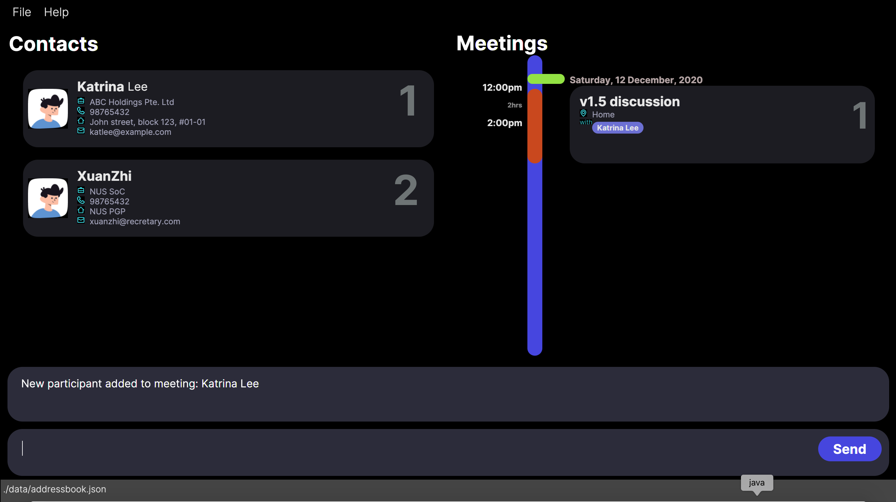

```
New participant added to meeting: NAME_OF_PARTICIPANT_ADDED
```

#### 4.2.3 Delete a participant into a meeting: `deletepart`

Deletes a participant with the specified `CONTACT_INDEX` in the currently displayed contact list into the meeting with the specified `MEETING_INDEX`.

Format: `deletepart ci/CONTACT_INDEX mi/MEETING_INDEX`

Examples:

-   `deletepart ci/1 mi/3` removes the first participant from the third meeting.

Example Usage: 
```
deletepart ci/1 mi/1
```

Expected result:

```
Participant is removed from meeting: NAME_OF_PARTICIPANT_DELETED
```

#### 4.2.4 Listing all meetings: `listmeeting`

Shows a list of all meetings in the address book.

Format: `listmeeting`

- Any trailing words following the command will be ignored.

Example Usage
```
listmeeting
```

Expected result: 
```
Listed all meetings
```

All existing meetings are listed.

#### 4.2.5 Editing a meeting: `editmeeting`

Edits an existing meeting in the meeting schedule. Similar to adding a meeting, the sorting and conflict checking will also take place automatically. The `RECURRENCE` field is not modifiable, and the edition of recurring meeting will only edit the specified instance. If the title of a recurring meeting is edited, it is no longer considered as an instance of recurrence.

Format: `editmeeting INDEX [d/DATETIME] [title/TITLE] [l/LOCATION] ...`

<div markdown="span" class="alert alert-primary">:bulb:

**Tip:**
You can add new participants to a meeting with the separate `addpart` command or delete existing participants in the meeting
with the `deletepart` command.

</div>

-   Edits the meeting at the specified `INDEX`. The index refers to the index number shown in the displayed meeting list.
    The index **must be a positive integer** 1, 2, 3, …​
-   At least one of the optional fields must be provided.
-   Existing values will be updated to the input values.

Examples:

* `editmeeting 1 d/10/11/20 1400 l/clementi` Edits the datetime and location of the 1st meeting to be 
`10/11/2020 1400` and `clementi` respectively.

Example Usage: 
```
editmeeting 2 title/DEF company meeting dur/00 30
```

Expected Outcome:
```
Edited Meeting: DEF company meeting Date and Time: 12 Dec 2020 12.00pm Duration:  30mins Location: Home Recurrence: Participants: none
```
Change the title and duration of the second meeting in the currently displayed meeting list to `DEF company meeting` 
and `30mins` respectively. Other attributes of the meeting remain unchanged. 
    
#### 4.2.6 Locating meetings: `findmeeting`

Find meetings whose data (matches title, date in all natural formats, location) contain any of the given keywords.

Format: `findmeeting KEYWORD [MORE_KEYWORDS]`

-   The search is case-insensitive. e.g `discuss` will match `Discuss`
-   The order of the keywords does not matter. e.g. `Shareholder Meeting` will match `Meeting Shareholder`
-   Most fields (title, date, time and location) are searched.
-   Meetings matching at least one keyword will be returned (i.e. `OR` search).
    e.g. `Shareholder Meeting` will return `Shareholder Chat`, `Team Meeting`

Examples:

-   `findmeeting abc def` returns `abc meeting`, `def meeting`<br>

Example Usage
```
findmeeting abc
```

Expected result
```
1 meeting listed
```

<div markdown="span" class="alert alert-primary">:framed_picture:

**Visual Walkthrough Guide:**

State of the app *BEFORE* the `findmeeting` command.

<br>
   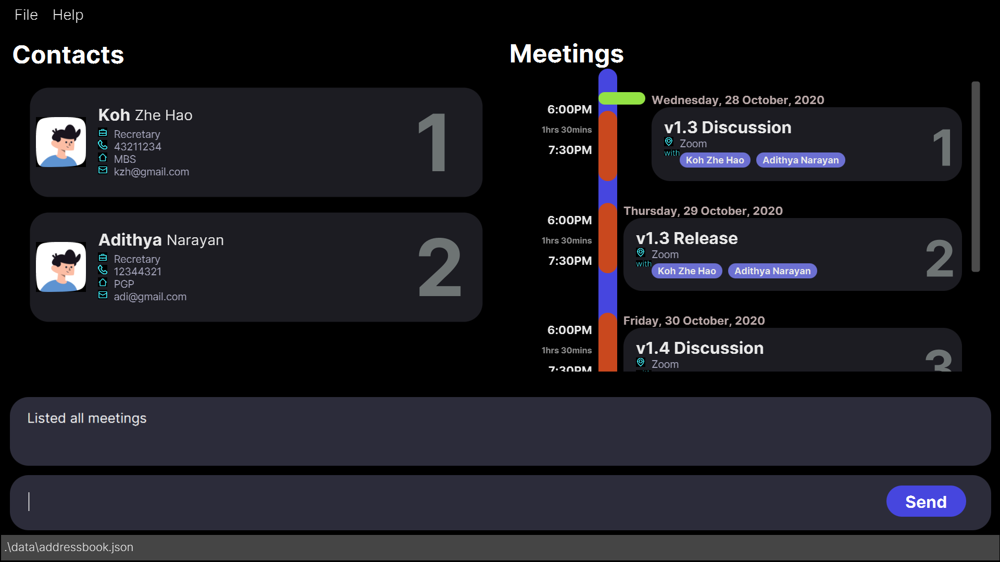
<br>
State of the app *AFTER* the `findmeeting v1.3` command.
<br>
   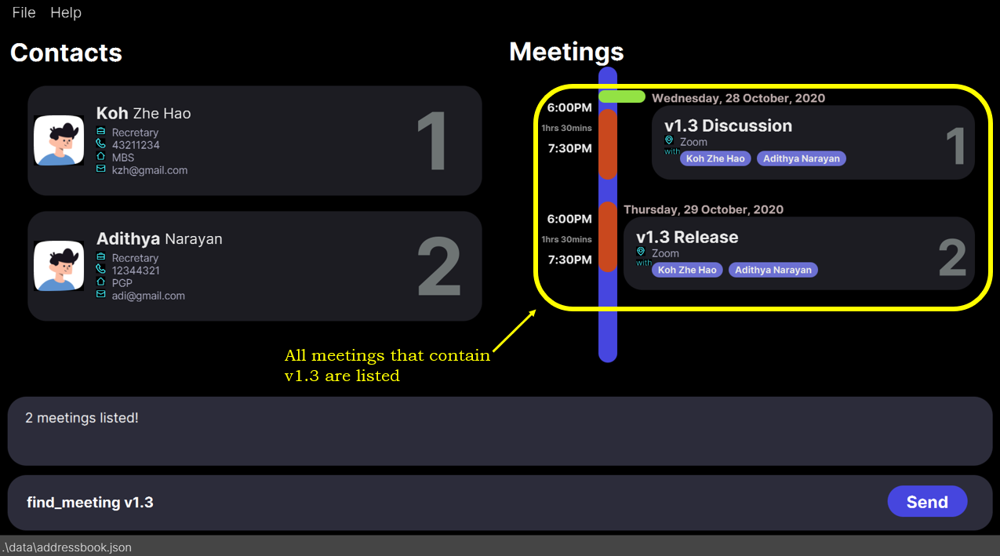
<br>
</div>

#### 4.2.7 Deleting a meeting: `deletemeeting`

Deletes the specified item (and its recurrences) from the address book.

Format: `deletemeeting INDEX [rec/RECURRING]`

* Deletes the meeting at the specified `INDEX`.
* The index refers to the index number shown in the displayed list.
* The index **must be a positive integer** 1, 2, 3, …​
* The recurring must be either `true` or `false`.

Examples:
* `deletemeeting 2` deletes the 2nd meeting in the meeting schedule.
* `deletemeeting 2 rec/true` deletes the 2nd meeting and all its recurrences in the address book.
* `findmeeting Shareholder` followed by `deletemeeting 1` deletes the 1st meeting in the results of the `find` command.

Example Usage
```
deletemeeting 3
```

Expected result: 
```
Deleted Meeting: Annual meeting Date and Time: 31 Dec 2020 2.00pm Duration:  50mins Location: John street, block 123, #01-01 Recurrence:  Participants: none
```
Deletes the second meeting in the currently displayed meeting list. 

<div markdown="block" class="alert alert-info">

**:information_source: Summary about recurring meetings:**<br>

- In `deletemeeting` there is an optional field `rec/RECURRING` which may be `true` or `false`. <br>
e.g. `rec/true` means to delete all recurrences of the specified meeting.
- In `addmeeting` there is an optional field `rec/RECURRENCE` which consists of two parts separated by `/` as mentioned above. <br>
e.g. `rec/weekly/5` means the meeting added has recurs weekly for 5 times.
- In `editmeeting`, the recurrence field is not editable. Edition will only affect a specific instance.

</div>

#### 4.2.8 Clearing all meetings : `clearmeeting`

Clears all meetings from the meeting schedule. Anything following the `clearmeeting` keyword will be ignored by the application.

Format: `clearmeeting`

Example Usage
```
clearmeeting
```

Expected result: 
```
Meetings has been cleared!
```

Remove all existing meeting from Recretary. You will now see an empty meeting list.
// add a warning here

#### 4.2.9 Remind meetings: `remindmeeting`

Search and display all meetings that will occur within the hours specify by the user. 

Format: `remindmeeting HOUR`

-   HOUR must be a positive integer, the range of this value is from 1 - 2147483647 (user most likely won't have so many data to keep track of in a practical usage).
-   The reference point of time is the time on user's local machine when user entered the command.

Examples:

-   `remindmeeting 1440` returns ` abc meeting`, `xyz meeting`<br> 
Remark: 1440 = 2(months) * 30(days) * 24(hours) which is the total hours for two months; user can use this strategy to standardize the unit of time(hours) beforehand

**Visual Walkthrough Guide:**

State of the app *BEFORE* the `remindmeeting` command.

   

State of the app *AFTER* the `remindmeeting 1440` command.

   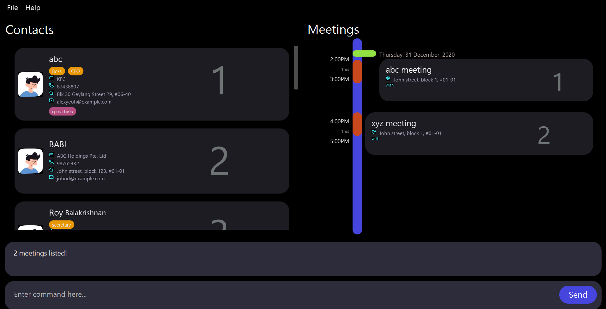

#### 4.2.10 Exporting meetings in .ics format : `exportmeeting`

Exports all meetings as an iCalendar file that is compatible with other calendar apps such as Google Calendar. 

Format: `exportmeeting`

- Any trailing words following the command will be ignored. By default, the resulting file can be found in the `data` folder. Check the FAQ section to see how to change the save location.

Example Usage
```
exportmeeting
```

Expected result: 

```
Meetings have been exported as .ics!
```

Export all existing meetings into a .ics file that can be find in the same folder of Recretary.

---

### 5 General

#### 5.1 Viewing help : `help` 

Shows a message explaining how to access the help page. Anything following the `help` keyword will be ignored by the application.

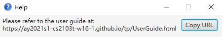

#### 5.2 Undo : `undo`

Undoes the previous command or previous `n` commands based on the given index.

<div markdown="span" class="alert alert-primary">:framed_picture:

**Visual Walkthrough Guide:**
<br>
1. State of the app *BEFORE* the `deletecontact` command that you entered by mistake and wish to undo.
<br>
   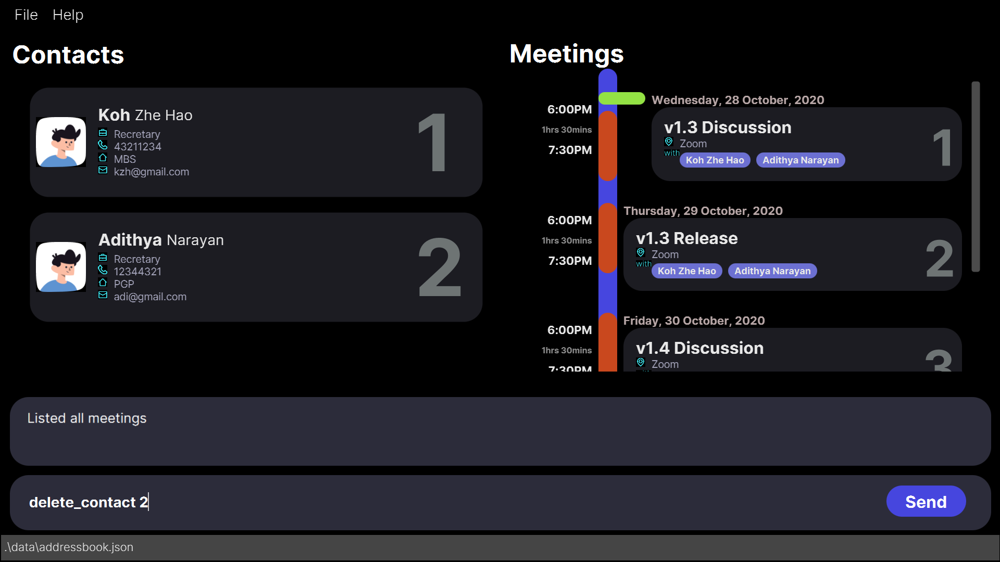
<br>
2. State of the app *AFTER* the `deletecontact` command that you entered by mistake and wish to undo.
<br>
   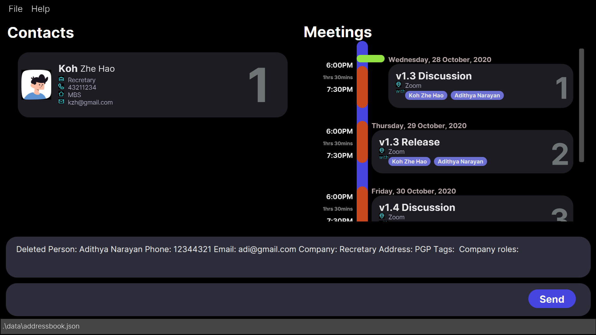
<br>
3. State of the app *AFTER* the `undo` command.
<br>
   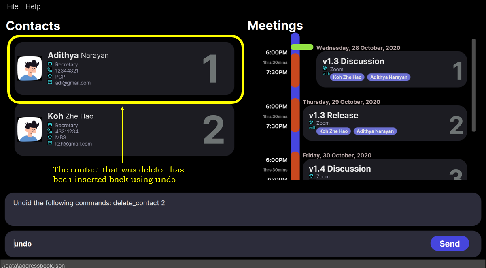
<br>
</div>

<div markdown="block" class="alert alert-info">

**:information_source: Notes about the undo command:**<br>

- `undo` command is purposefully left out of the history and is hence not undoable. This is because you can undo previous commands before the undo to prevent being stuck in an undo loop. 
- `exportmeeting` command cannot be undone as it exports outside the app scope.

</div>

Format: `undo [INDEX]`


#### 5.3 Command Session History

You can easily scroll up and down through the list of previous successful commands using the `UP` and `DOWN` key on your keyboard while in the command box.
<div markdown="span" class="alert alert-primary">:framed_picture:

**Visual Walkthrough Guide:**
<br>
   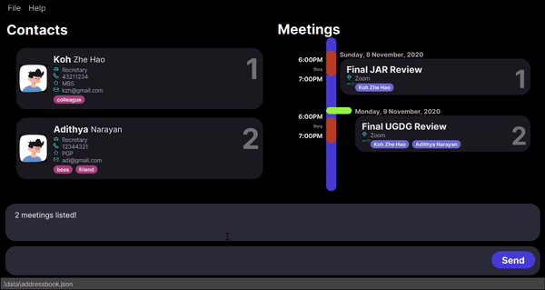
<br>

</div>

<div markdown="block" class="alert alert-info">

**:information_source: Notes about the command session history:**<br>

- Only successful previous commands (commands that did not give an error), are stored in the command history. This decision was taken deliberately because of the fact that if there is an error in the command, the command doesn't disappear but it stays in the command box highlighted in red.
- Be cautious as your current command is wiped out when you move up or down ( similar to the windows cli).

</div>

#### 5.4 Update user preference : `edituserpref`

-  Edit the user preferred intervals between meetings. Data for user preferences is stored in the file **preferences.json**. 
-   The dafault value is 0 (which means that interval is not considered). 
-   This interval value will be used for conflict checking and meant to simulate the resting or travel time between meetings.
-  `i/INTERVAL` indicates the interval between meetings. Note that there is a range restriction similar to the `remindmeeting` command

#### 5.5 Viewing previous commands 

Pressing the `up` arrow key will change the content of the input box to the previous command that was executed (if one exists). Similarly, pressing the `down` arrow will display the command that was executed after the current one. Press an arrow key multiple times to navigate through multiple commands.

<div markdown="block" class="alert alert-info">

**:information_source: Notes about viewing previous/later commands:**<br>

- Only commands that were successfully executed can be viewed. 
- If there is any text in the input box when an arrow key is pressed, it will be cleared and cannot be navigated back to.

</div>

#### 5.6 Saving the data

Recretary data are saved in the hard disk automatically after any command that changes the data. There is no need to save manually.

#### 5.7 Exiting the program : `exit`

Exits the program. Anything following the `exit` keyword will be ignored by the application.

Format: `exit`
---

## 6 FAQ

**Q**: How do I transfer my data to another Computer?<br>
**A**: Install the app in the other computer and overwrite the empty data file it creates with the file that contains the data of your previous Recretary home folder.

**Q**: Where is my Recretary data stored?<br>
**A**: By default, a  `data` folder will be created in the same folder as the JAR file. After running the app for the first time, you can change the file path by editing preferences.json in the same folder directly. 


---

## 7 Command summary

Action | Format, Examples
--------|------------------
***Generals*** |
**Help** | `help`
**Exit** | `exit`
**Undo** | `undo [INDEX]` <br> e.g., `undo 3` or `undo`
**Edit user preference** | `edituserpref i/INTERVAL` <br> e.g., `edituserpref i/10`
***Contacts*** |
**Add** | `addcontact n/NAME p/PHONE_NUMBER e/EMAIL a/ADDRESS c/COMPANY [r/COMPANY_ROLE] [t/TAG]…` <br> e.g., `addcontact n/James Ho p/22224444 e/jamesho@example.com a/123, Clementi Rd a/XYZ Company r/manager t/friend` 
**Delete** | `deletecontact INDEX` <br> e.g., `deletecontact 3`
**Edit** | `editcontact INDEX [n/NAME] [p/PHONE_NUMBER] [e/EMAIL] [a/ADDRESS] [c/COMPANY] [r/COMPANY_ROLE] [t/TAG]…`<br> e.g.,`editcontact 2 n/James Lee e/jameslee@example.com`
**Find** | `findcontact KEYWORD [MORE_KEYWORDS]`<br> e.g., `findcontact James Jake`
**List** | `listcontact`
**Clear** | `clearcontact`
***Meetings*** |
**Add** |`addmeeting d/DATETIME dur/DURATION title/TITLE l/LOCATION [rec/RECURRENCE]` <br> e.g., `addmeeting d/31/12/20 1400 dur/01 00 title/xyz meeting l/John street, block 1, #01-01 rec/weekly/5`
**Add Participant** |`addpart ci/INDEX mi/INDEX`<br> e.g., `addpart ci/1 mi/3`
**Delete Participant** | `deletepart ci/CONTACT_INDEX mi/MEETING_INDEX` <br> e.g., `deletepart ci/1 mi/3`
**Delete** | `deletemeeting INDEX [rec/RECURRING]`<br> e.g., `deletemeeting 5 rec/true`
**Edit** | `editmeeting INDEX [d/DATETIME] [dur/DURATION] [t/TITLE] [l/LOCATION]`<br> e.g.,`editmeeting 1 dur/01 30 l/COM2 LT17`
**Find** | `findmeeting KEYWORD [MORE_KEYWORDS]`<br> e.g., `findmeeting recretary stakeholders`
**List** | `listmeeting`
**Clear** | `clearmeeting`
**Remind** | `remindmeeting HOUR` <br> e.g., `remindmeeting 24`
**Export** | `exportmeeting`


---

## 8 Prefix summary

Prefix | Commands | Description
--------|-----------|--------
i/ | `edituserpref` | interval between meetings
n/ | `addcontact`, `editcontact` | name of a contact 
p/ | `addcontact`, `editcontact` | phone number of a contact 
e/ | `addcontact`, `editcontact` | email of a contact 
a/ | `addcontact`, `editcontact` | address of a contact 
c/ | `addcontact`, `editcontact` | company of a contact 
r/ | `addcontact`, `editcontact` | company role of a contact 
t/ | `addcontact`, `editcontact` | tag of a contact 
d/ | `addmeeting`, `editmeeting` | date and time of a meeting 
l/ | `addmeeting`, `editmeeting` | location of a meeting 
ci/ | `addpart`, `deletepart` | index of contact 
mi/ | `addpart`, `deletepart` | index of meeting 
dur/ | `addmeeting`, `editmeeting` | duration of a meeting
rec/ | `addmeeting`, `deletemeeting` | recurrence of a meeting  
title/ | `addmeeting`, `editmeeting` | title of a meeting 

---

## 9 Glossary

* **CLI**: Command Line Interface. A program that accepts text input to execute system functions.
* **GUI**: Graphic User Interface. A system of interactive visual components for computer software.

---
